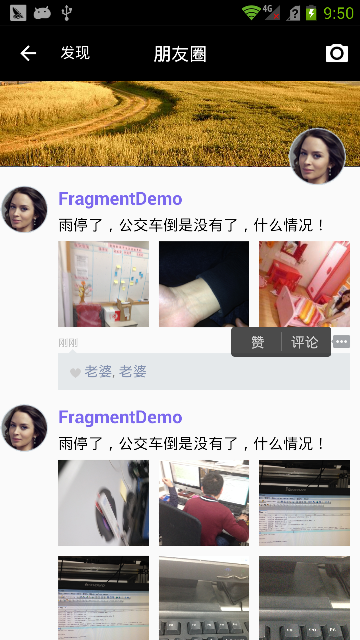

# WeChatDemo
单个Activity+多个Fragment实现微信 Android客户端

# 项目介绍

# 效果图  

# 感谢
[YoKeyword/Fragmentation](https://github.com/YoKeyword/Fragmentation)  
欢迎大家[fork YoKeyword的Fragmentation](https://github.com/YoKeyword/Fragmentation)，非常不错的一个开源项目。

