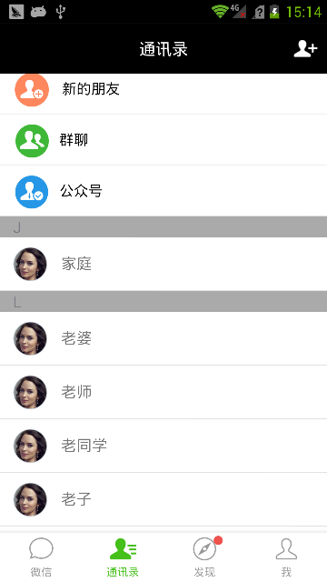
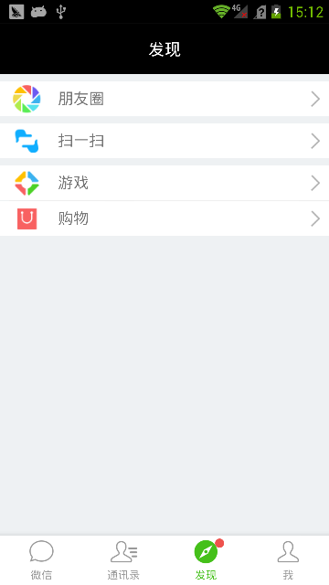
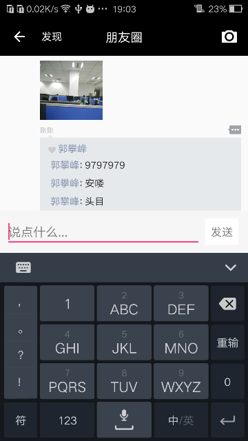
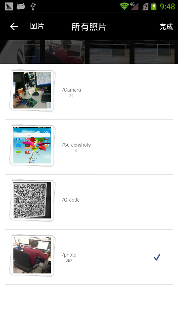
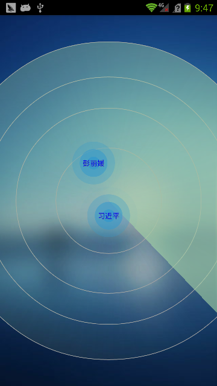
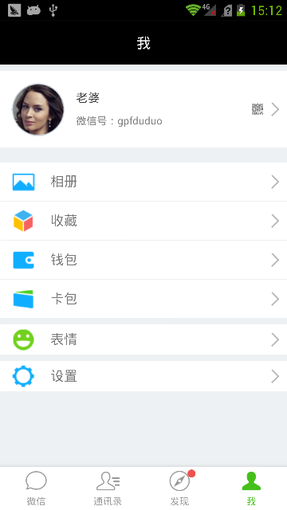
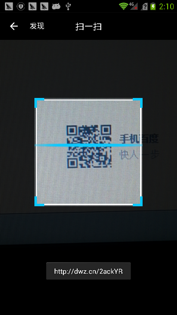
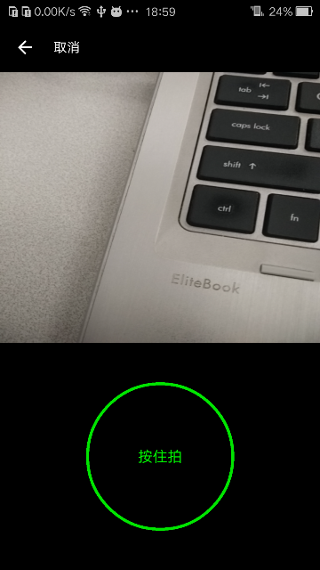

# WeChatDemo

使用单个Activity和多个Fragment实现的微信android客户端。引用了很多开源库，很不错，在写的过程中逐步吸…… 

# Introduction
本工程实现了以下功能：  
1、 全局只有一个Activity，其他全是Fragment。由于底部的选择tab页面是放在Activity中实现的，  为了实微信的效果，单独对底部tab也实现了动画。如果想要真正的实现微信的效果，主页必须使用ViewPag+Fragment的方式。  
2、引入了Fragment的转场动画  
3、通过ViewDragHelper，引入了SwipeBack功能，所有的Fragment都可以滑动退出  
4、聊天框实现默认输入法和底部选择输入框的平滑切换，点击其他地方输入法和选择框都会消息，进入聊天界面默认不显示输入框  
5、试下了通过雷达添加好友的效果图  
6、实现了二维码扫描页面（zbar），本功修改了原来工程的内存泄露问题  
7、实现了朋友圈的效果，具体的：实现了图片分享、本地图片的选择（类似于微信）、朋友圈的暂停和评论效果； 朋友圈最上面背景图片的切换；小视频的录制和在朋友圈列表的播放能力：播放一个小视频另一个小视频会结束，显示缩略图。  

#GIF效果图

 

# 效果图  
 

  

# 感谢与引入库  
1. [RadarScanViwe](https://github.com/gpfduoduo/RadarScanView) 我自己写的雷达效果图，用与查找身边的人效果
2. [YoKeyword/Fragmentation](https://github.com/YoKeyword/Fragmentation)  欢迎star 和 fork [YoKeyword的Fragmentation](https://github.com/YoKeyword/Fragmentation)
3. [PhotoView](https://github.com/chrisbanes/PhotoView)  
4. [ViewPagerFix](https://github.com/chrisbanes/PhotoView/issues/31)    
5. [Glide](https://github.com/bumptech/glide)  
6. [QrCodeScan](https://github.com/SkillCollege/QrCodeScan), 请注意：这个开源库是有内存泄露的， **在我的引用中，我解决了它**.    
7. [VideoPlayerManager](https://github.com/danylovolokh/VideoPlayerManager) 一个非常好的在ListView或者Recycle中播放视频的工程

# License  
Copyright 2016 gpfduoduo

Licensed under the Apache License, Version 2.0 (the "License");
you may not use this file except in compliance with the License.
You may obtain a copy of the License at  
   http://www.apache.org/licenses/LICENSE-2.0  
Unless required by applicable law or agreed to in writing, software
distributed under the License is distributed on an "AS IS" BASIS,
WITHOUT WARRANTIES OR CONDITIONS OF ANY KIND, either express or implied.
See the License for the specific language governing permissions and
limitations under the License.
